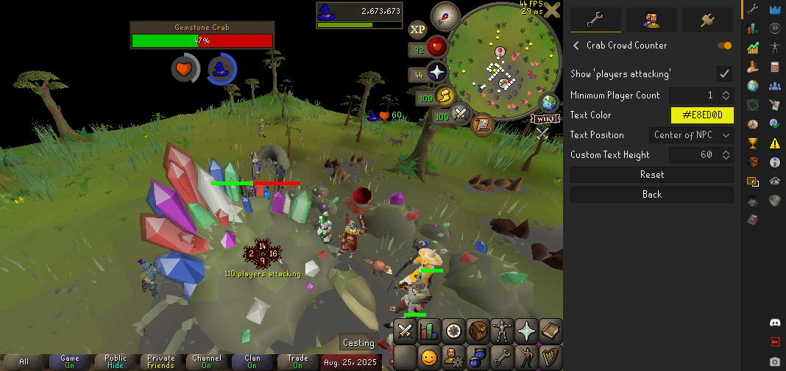
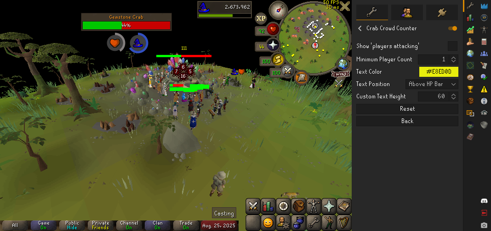
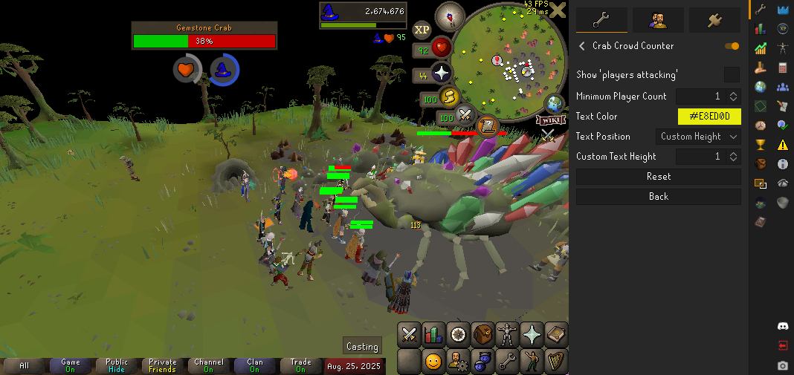

# Crab Crowd Counter

A lightweight and customizable plugin that displays the number of players attacking the Gemstone Crab. This helps you quickly tell how many people youre competing against for gems, without overloading the UI.

## Features

*   **Player Count Overlay:** Displays the number of players currently attacking each Gemstone Crab.
*   **Customizable Display:** Change the text color, position, and visibility to your liking.
*   **Minimum Player Count:** Only show the overlay when the number of players attacking a crab is above a certain threshold.

## Screenshots

## Configuration

The plugin offers the following configuration options:

*   **Show 'players attacking':** When enabled, the text "players attacking" will be displayed after the number.
*   **Minimum Player Count:** Only show the counter when the player count is at or above this number.
*   **Text Color:** The color of the player count text.
*   **Text Position:** Where to display the text in relation to the crab. Options are:
    *   Center of NPC
    *   Above NPC
    *   Custom (set your own height)
*   **Custom Text Height:** Only used when "Text Position" is set to "Custom".

## Known Issues

*   There are no known issues at this time.

## Release Notes

**v1.0.0 - Initial Release**

*   Initial release of the Crab Crowd Counter plugin.
